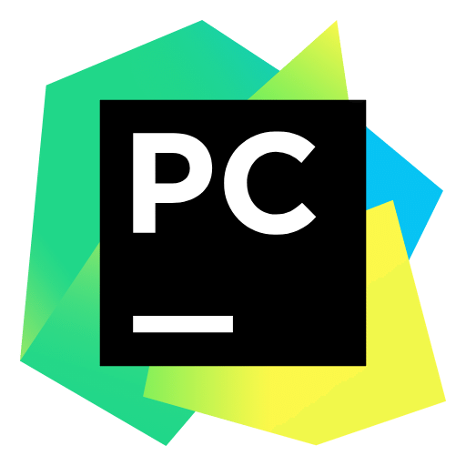
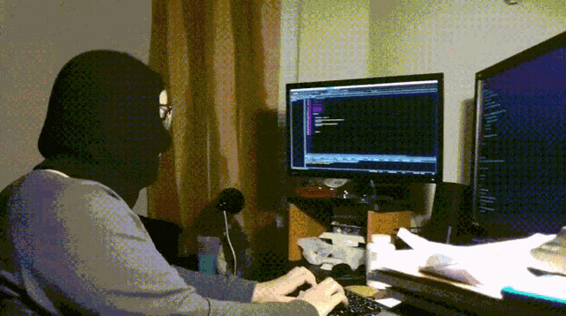

  

  <h1>Hello!</h1>

 

  
  
  <h2>Languages, Tools and OC</h2>

  
  
  

  
  
  

  
  

  <h2>IT Mems</h2>

  

  

  <h2>Follow me</h2>

  <a href="https://www.twitch.tv/bazipl1" target="_blank">Twitch</a>

